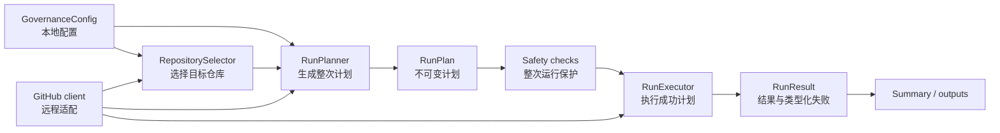

# MathArts Sync Labels 版本路线图

更新日期：2026-07-15

## 当前基线：v1.3.0

`v1.3.0` 已经具备完整且可靠的单仓库同步核心：

- 默认 dry-run，并区分组织受管标签和仓库扩展标签
- 创建、更新、重命名、删除、未变化和保留的完整计划
- `SyncPlanner` / `SyncPlan` / `SyncExecutor` 的 Plan / Apply 分层
- 配置和计划前置校验、读取请求重试、跨仓库失败隔离
- job summary 和结构化 Action outputs
- 无运行时 Gem 依赖，发布实现使用 Ruby 3.1 或更高版本

截至本路线图更新时，测试基线为 38 个测试、184 个断言，全部通过；核心入口和 `src/` 的行覆盖率约为 91.8%。覆盖率只是辅助证据，不代替行为与集成验证。

## 当前开发基线：Node.js 24 迁移

主分支的下一版本正在保持 v1.3 对外契约的前提下迁移到 GitHub 原生 Node.js 24 Action：

- TypeScript strict 和 pnpm 锁文件提供可复现的开发与构建环境
- `action.yml` 直接执行提交的 `dist/index.js`，调用方不再依赖 Ruby 或 Bash
- `GovernanceConfig` 已收敛为纯本地配置模块，`RepositorySelector` 独占远程仓库选择
- `GitHubClient` 已隐藏 REST 路径、分页、响应解析和读取重试
- 配置、计划、传输、执行、报告和主入口测试已拆分为独立文件
- Node 测试继续固定 v1.3 的 dry-run、写请求不重试、失败隔离和部分完成计数语义
- `test/fixtures/ruby-v1.3-behavior.json` 固定 Ruby 基线的配置、仓库选择、重试矩阵、计划、请求顺序、输出、摘要和 Unicode 行为，Node parity 测试持续对照该快照

语言迁移不加入删除保护、`exclude`、`RunPlan` 或计划摘要；这些功能仍按下述版本路线推进。

## 代码与设计评估

### 可以继续保留的设计

- `SyncPlanner` 是纯计算模块，接口小，能够一次生成完整仓库计划
- `SyncPlan` 会验证并冻结计划，调用方不能绕过计划约束直接构造任意操作
- `SyncExecutor` 只接受已验证计划，并能在部分写入失败时返回已经完成的计数
- GitHub 读取重试与写入不重试的边界符合“避免重复变更”的安全目标
- 配置解析保持 Ruby v1.3 的 YAML 1.1 标量语义，同时禁用 aliases、拒绝未知字段，并对标签所有权和 alias 关系进行交叉校验

### 下一阶段必须先处理的设计约束

| 现状 | 影响 | 调整方向 |
| --- | --- | --- |
| `RepositorySynchronizer#sync` 把读取、规划和执行绑在一起 | 无法在任何写入前检查整次运行的删除上限或计划摘要 | 将 Plan / Apply 提升到整次运行级别 |
| `Application` 按仓库“规划后立即执行” | 后面的仓库规划失败时，前面的仓库已经被修改 | 完成全部仓库规划后，再按不可变 `RunPlan` 执行成功计划 |

路线图因此按“整次运行安全 → 配置与范围 → 审计”推进。性能优化和破坏性升级没有证据支撑，暂不排期。

目标模块关系：



## 版本总览

| 版本 | 目标窗口 | 重点 | 发布结果 |
| --- | --- | --- | --- |
| `v1.4.0` | 2026-08 | 整次运行的安全基础 | 所有仓库先规划后写入，危险删除在写入前被阻止 |
| `v1.5.0` | 2026-09 | 配置、范围与诊断 | 可排除仓库、离线验证配置并获得稳定错误类别 |
| `v1.6.0` | 2026-Q4 | 可选计划审计 | 可保存、比较并选择性绑定 dry-run 与真实执行 |

## v1.4.0：整次运行的安全基础

### 目标

先把当前可靠的单仓库 Plan / Apply 扩展为可靠的整次运行 Plan / Apply，再增加删除保护。这个版本既处理设计债务，也交付直接降低误操作风险的能力。

### 设计改造

- 保持 Node 迁移建立的不可变本地 `GovernanceConfig`
- 扩展 `RepositorySelector`，但继续让它独占远程仓库发现、状态校验和单仓库选择
- 保持 GitHub 客户端的领域接口，由客户端独占 URL、分页和响应结构
- 用带 `category`、HTTP 状态和安全消息的类型化错误替换字符串拼接错误
- 新增不可变 `RunPlan`，包含目标仓库、每仓库 `SyncPlan`、规划失败和整次运行计数
- 将 `RepositorySynchronizer` 的读取/规划/执行组合拆成整次运行的 `RunPlanner` 和 `RunExecutor`
- 保持 `Application#run` 为外部主接口，隐藏模块装配、执行顺序和失败聚合
- 让 job summary 和 outputs 从同一份 `RunResult` 派生，避免新增字段后统计分叉

### 用户功能

- 策略新增可选删除保护：

  ```yaml
  safety:
    deletions: allow
    max_deletions_per_repository: 5
    max_deletions_total: 20
  ```

- `deletions` 支持 `allow` 和 `deny`；未配置时保持 `allow`，兼容 `v1.3.0`
- 写入模式先规划所有仓库，再检查单仓库和整次运行删除上限
- 删除保护不满足时，整次运行不进入 Apply；单仓库规划失败仍按现有语义隔离，其他已成功规划的仓库可以执行
- job summary 增加规划阶段、执行阶段和删除风险区块

### 测试与质量

- 在按 seam 拆分的 Node 测试基础上补齐整次运行测试
- 新增主入口集成测试，覆盖成功 dry-run、成功写入、规划失败和部分执行失败
- 保留纯 `SyncPlanner` 契约测试，并从 `Application#run` 接口验证整次运行行为
- CI 保持 Node 24 类型检查、行为测试、bundle 一致性和 Action 固定引用检查

### 发布验收

- 禁止删除或超过任一删除阈值时，写请求数为零
- 规划阶段会先检查全部仓库；单仓库规划失败不阻止其他成功计划执行，并保留准确的最终失败状态
- Apply 顺序稳定，单仓库写入失败仍不阻止后续仓库执行
- `GovernanceConfig` 构造后修改原始 Hash 或 Array 不会改变运行结果
- 除 GitHub 客户端外，源码不再构造 GitHub REST 路径或解释原始响应
- `v1.3.0` 的合法配置在未设置 `safety` 时产生相同的仓库级计划和最终状态
- Node 24 CI、主入口集成测试和失败恢复测试全部通过

## v1.5.0：配置、同步范围与故障诊断

### 目标

在 `v1.4.0` 的清晰模块 seam 上补齐最常见的范围控制和配置维护需求，不把更多规则继续塞回配置解析或 HTTP 传输模块。

### 用户功能

- `label-policy.yml` 的 `repositories` 新增 `exclude`
- 仓库选择顺序固定为：选择全部仓库或 `include`，再应用 `exclude`
- 同一仓库同时出现在 `include` 和 `exclude` 时配置校验失败
- `repository` input 指定被排除仓库时明确失败，不静默跳过
- 新增 `validate_only` input，只校验标签配置和策略，不要求 token、owner 或网络访问
- 新增本地配置校验入口，与 Action 复用同一配置模块
- 稳定错误类别包括 `configuration`、`repository_selection`、`authentication`、`rate_limit`、`network`、`planning` 和 `apply`
- 新增 `failed_repositories` output，输出按仓库全名稳定排序的 JSON 数组
- summary 根据错误类别给出对应处置建议

### 设计约束

- `RepositorySelector` 独占 include、exclude、显式单仓库和仓库状态规则
- `validate_only` 直接使用本地配置模块，不创建 GitHub 客户端
- HTTP 状态到错误类别的映射只存在于 GitHub 客户端
- 不引入新的配置抽象层，不自动修复或改写用户配置

### 发布验收

- 全部仓库、仅 `include`、仅 `exclude`、两者组合和单仓库 input 均有接口测试
- archived、disabled、fork 与 `exclude` 组合不会扩大同步范围
- `validate_only` 在空 token、空 owner 和无网络环境中可以验证合法配置，API 调用次数为零
- 本地入口与 Action 对同一配置返回相同结果和错误类别
- `failed_repositories` 始终是合法、稳定排序的 JSON
- 日志、summary 和 outputs 不包含 token、Authorization header 或未经筛选的响应正文

## v1.6.0：可选的计划审计

### 目标

复用 `v1.4.0` 的不可变 `RunPlan` 提供审计产物。该能力服务于需要长期留档或严格审批的组织，不强制普通用户改变 workflow。

### 用户功能

- 每次运行生成 JSON 计划，包含 `schema_version`、目标仓库、操作、删除原因、汇总计数和规划失败
- 新增 `plan_path` output，返回 runner 上的计划文件路径
- 新增 `plan_digest` output，返回规范化计划内容的 SHA-256
- 新增可选 `expected_plan_digest` input
- 写入模式设置预期摘要时，只有重新规划得到相同摘要才进入 Apply
- 摘要不匹配时整次运行停止；未提供摘要时保持现有写入行为
- README 提供上传计划 artifact、Environment 审批和携带摘要执行的示例

### 设计约束

- JSON 序列化属于 `RunPlan` 的一个稳定表示，不再创建第二套计划模型
- 计划按仓库全名和固定操作顺序输出，时间戳、临时路径和日志文本不参与摘要
- 不自动下载或信任外部计划文件
- 不强制所有写入提供计划摘要

### 发布验收

- 相同配置和仓库状态在 API 返回顺序变化时生成相同 JSON 和摘要
- 配置、策略、目标仓库集合或现有标签变化都会改变摘要
- 摘要不匹配或任一仓库规划失败时，写请求数为零
- 未设置 `expected_plan_digest` 的现有 workflow 行为保持兼容
- JSON 格式从 `schema_version: 1` 开始，并有逐字段契约测试

## v1.6.0 之后的决策门槛

后续版本不预先绑定功能或日期：

- 只有实际运行时间、请求量或限流记录证明串行规划成为瓶颈，才考虑有界并发
- 只有多个使用方需要同一种新策略，才扩展策略格式
- 只有必须改变删除默认值、配置格式或写入契约时，才规划 `v2.0.0`
- 安全缺陷、错误删除风险和 GitHub API 兼容问题始终优先于新功能

## 补丁版本与维护

- `v1.3.x` 只接收严重回归和安全修复
- 新次版本发布后，前一个次版本继续接收严重回归和安全修复，直到下一个次版本发布
- 补丁版本不得改变同步范围、删除语义、配置格式或 output 含义
- 每个次版本至少发布一个候选版本，并完成 dry-run 和单仓库写入演练

## 每个版本共同发布门槛

- Node 24 类型检查、行为测试和 bundle 一致性检查全部通过
- 所有第三方 Action 固定到完整 Commit SHA
- 配置、仓库选择、计划、执行和主入口均有接口级行为测试
- README、Action metadata、路线图和发布说明保持一致
- 涉及写入的版本完成 dry-run、单仓库写入和失败恢复演练
- 日志、计划、summary 和 outputs 不暴露令牌或敏感响应字段

## 暂不纳入

- 同步 Milestone、Project 字段、Issue 内容或负责人
- 自动创建或分发 GitHub App 凭据
- 自动重试结果未知的创建、更新、重命名或删除请求
- 没有运行数据支撑的并发、缓存或批处理优化
